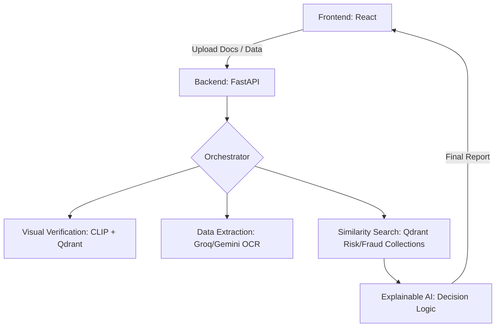

# TrustLend: AI-Powered Secure Lending & Fraud Detection

TrustLend is a secure, AI-driven lending platform designed to evaluate loan applications with high accuracy and transparency. By leveraging **Vector Search (Qdrant)** and **Explainable AI (Groq/Gemini)**, TrustLend compares new applications against historical "Risk Twins" and fraud patterns to provide human-readable justifications for every credit decision.

---

---

## 🛠 Technologies Used

### Backend & AI
*   **Python 3.11** (Core Logic)
*   **FastAPI** (High-performance API framework)
*   **Qdrant Cloud** (Vector Database for Similarity Search)
*   **FastEmbed / CLIP-ViT-B-32-vision** (Image & Text Embeddings)
*   **Groq Client / Google Gemini** (LLM for OCR, reasoning, and explanation)
*   **Scikit-learn & Joblib** (Feature engineering and ML preprocessing)
*   **Numpy & Pandas** (Data manipulation)

### Frontend
*   **Node.js & React** (User Interface)
*   **Tailwind CSS** (Styling)
*   **Lucide React** (Icons)

---

## Project Architecture



---

##  Project Hierarchy
```text
hackaton2026/
├── credit-decision-memory/
│   ├── app/
│   │   ├── api/             # FastAPI Endpoints (/analyze_loan, /extract)
│   │   ├── core/            # Feature engine & Qdrant Orchestrator
│   │   ├── models/          # Pydantic schemas (LoanApplicationInput, etc.)
│   │   └── services/        # Qdrant & LLM Integration logic
│   ├── requirements.txt     # Backend Dependencies
│   └── main.py              # Entry point
├── documents_verification/
│   ├── QdrantIDCard.ipynb   # Embedding logic for ID verification
│   └── documents_verification.py
└── front/
    ├── src/                 # React components & services
    ├── package.json         # Frontend Dependencies
    └── App.tsx
```

---

##  Detailed Qdrant Integration

Qdrant serves as the **"Memory"** of the platform, used in three distinct stages:

1.  **Visual Identity Verification:**
    *   **Model:** `clip-ViT-B-32-vision`.
    *   **Logic:** Scanned ID cards are embedded into vectors. We search a "Validation Collection" to classify document types and detect forged IDs by comparing visual features against known authentic templates and flagged fraudulent documents.

2.  **Risk Twin Retrieval:**
    *   **Logic:** Loan application features (income, CIBIL score, DTI ratio) are converted into vector representations.
    *   **Search:** We perform a similarity search in the `risk_collection` to find historically "similar" borrowers. This allows the AI to say: *"This applicant is 95% similar to 5 past borrowers who successfully repaid their loans."*

3.  **Fraud Detection:**
    *   **Logic:** Real-time transaction patterns (velocity, location, IP sharing) are checked against a `fraud_collection`.
    *   **Payload:** Every vector stores a detailed payload (UUIDs, transaction notes, fraud flags), enabling granular filtering during the search process.

---

##  Setup and Installation

### Prerequisites
*   Python 3.11+
*   Node.js 18+
*   Qdrant Cloud Account

### 1. Environment Configuration
Create a `.env` file in the `credit-decision-memory/` directory:
```env
GROK_API_KEY=your_grok_key
QDRANT_URL=your_qdrant_cloud_url
QDRANT_API_KEY=your_qdrant_api_key
```

### 2. Backend Installation
```bash
cd credit-decision-memory
python -m venv venv
source venv/bin/activate  # On Windows: venv\Scripts\activate
pip install -r requirements.txt
uvicorn app.main:app --reload
```

### 3. Frontend Installation
```bash
cd front
npm install
npm start
```

---

## Usage Examples

### Analyze a Loan Application
Submit a full application package including personal data and transaction history to receive a decision.

**Endpoint:** `POST /analyze_loan`

**Sample Request Body:**
```json
{
  "application": {
    "application_id": "APP-9921",
    "loan_type": "Personal Loan",
    "loan_amount_requested": 50000,
    "monthly_income": 6500,
    "cibil_score": 750,
    "employment_status": "Salaried"
  },
  "transactions": [
    {
      "transaction_id": "TXN-001",
      "transaction_amount": 120.50,
      "merchant_category": "Utilities",
      "transaction_status": "Success"
    }
  ]
}
```

**AI-Driven Response:**
```json
{
  "decision_status": "APPROVED",
  "confidence_score": 92,
  "explanation": "Applicant shows high income stability and matches 3 'Risk Twins' with perfect repayment history.",
  "risk_twins": [...],
  "fraud_matches": []
}
```

---

## Team Members
*   **Farouk Daboussi** - AI & Backend Lead
*   **Rabii Nasri** - Frontend Architect
*   **Youssef Baryoul** - Data Science & Embeddings
*   **Rym Tangour** - Quality Assurance & Testing
*   **Bechir Mlaouhia** - System Design & Documentation

---

###  Note for Judges
*   All core logic is located in the **`main`** branch.
*   Complexity in visual embedding and cross-validation is documented via inline comments in `vector_utils.py` and `feature_engine.py`.

***

